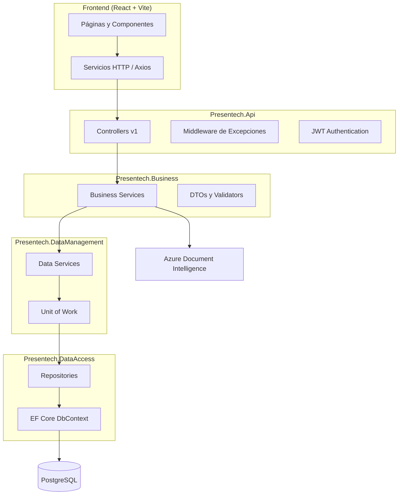

# G1-2519: PresenTech — Sistema Inteligente de Gestión de Asistencia Docente

## Descripción

PresenTech es una aplicación web full-stack para la gestión de asistencia docente en instituciones educativas. El sistema permite a profesores registrar y consultar asistencia por clase y horario, visualizar indicadores de desempeño, generar reportes y exportarlos en PDF. Los administradores gestionan el catálogo académico (profesores, paralelos, materias, clases, horarios y estudiantes), consultan dashboards institucionales y utilizan OCR para digitalizar listas de estudiantes.

El frontend está orientado a la **Unidad Educativa Fe y Alegría La Dolorosa** (configurable mediante variables de entorno).

## Objetivos

Según las capacidades implementadas en el código, el sistema busca:

- Digitalizar y centralizar el registro de asistencia estudiantil por sesión de clase.
- Reducir la carga administrativa mediante importación de estudiantes (Excel/OCR) y reportes automatizados.
- Ofrecer visibilidad del desempeño de asistencia mediante dashboards con indicadores de riesgo (estudiantes con 2 o más faltas).
- Facilitar la administración académica (profesores, paralelos, materias, clases, horarios y estudiantes) desde un panel dedicado.
- Recopilar opiniones y recomendaciones de los docentes sobre el uso del sistema.

## Características Principales

- **Autenticación JWT** para profesores y administradores con roles diferenciados.
- **Gestión de clases y horarios** con calendario semanal para docentes.
- **Registro de asistencia** por horario y fecha (presente, ausente, atrasado).
- **Dashboard** con totales de clases, estudiantes, porcentaje global de asistencia y panel de estudiantes en riesgo.
- **Reportes de asistencia** por clase y rango de fechas, con clasificación (Excelente, Regular, Riesgo).
- **Matriz anual de asistencia** y reportes trimestrales por estudiante (módulo administrativo).
- **Importación de estudiantes** desde Excel y mediante **OCR con Azure Document Intelligence** (captura con cámara o imagen).
- **Exportación PDF/Excel** en el frontend (`jspdf`, `xlsx`, `xlsx-js-style`).
- **Módulo de opiniones y recomendaciones** para docentes autenticados.
- **API REST versionada** (`v1`) con documentación Swagger en entorno de desarrollo.
- **Despliegue automatizado** en Azure (Static Web Apps para frontend, Container Apps para backend).

## Tecnologías Utilizadas

### Backend

| Tecnología | Versión / Detalle |
|---|---|
| .NET | 10.0 (`net10.0`) |
| ASP.NET Core Web API | Presentech.Api |
| Entity Framework Core | 10.0.4 |
| PostgreSQL (Npgsql) | Npgsql.EntityFrameworkCore.PostgreSQL 10.0.1 |
| Autenticación JWT | Microsoft.AspNetCore.Authentication.JwtBearer 8.0.25 |
| Validación | FluentValidation 11.11.0 |
| Hash de contraseñas | BCrypt.Net-Next 4.0.3 |
| Versionado de API | Asp.Versioning.Mvc 8.1.1 |
| Documentación API | Swashbuckle.AspNetCore 6.6.2 |
| Contenedorización | Docker (imagen base `mcr.microsoft.com/dotnet/aspnet:10.0`) |

### Frontend

| Tecnología | Versión / Detalle |
|---|---|
| React | 19.2.5 |
| Vite | 8.0.10 |
| React Router DOM | 6.30.3 |
| Tailwind CSS | 4.3.0 |
| Axios | 1.16.1 |
| date-fns | 4.2.1 |
| react-big-calendar | 1.19.4 |
| react-webcam | 7.2.0 |
| jsPDF + jspdf-autotable | 4.2.1 / 5.0.8 |
| xlsx / xlsx-js-style | 0.18.5 / 1.2.0 |
| Lucide React | 1.16.0 |
| Font Awesome Free | 7.2.0 |

### Base de datos e integraciones

- **PostgreSQL** como motor relacional.
- **Azure Document Intelligence** para OCR de listas de estudiantes.

### Infraestructura y CI/CD

- **Azure Static Web Apps** — despliegue del frontend.
- **Azure Container Apps** — despliegue del backend vía Docker Hub (`sazapatac/presentech`).
- **GitHub Actions** — pipelines de despliegue automático.

## Librerías y repositorios de terceros

Listado de dependencias directas declaradas en el proyecto, con su licencia y repositorio de origen. Las licencias indicadas corresponden a las publicadas en NuGet/npm al momento de la documentación.

### Backend — paquetes NuGet

| Librería | Versión | Licencia | Repositorio |
|---|---|---|---|
| [Asp.Versioning.Mvc](https://www.nuget.org/packages/Asp.Versioning.Mvc) | 8.1.1 | MIT | https://github.com/dotnet/aspnet-api-versioning |
| [Asp.Versioning.Mvc.ApiExplorer](https://www.nuget.org/packages/Asp.Versioning.Mvc.ApiExplorer) | 8.1.1 | MIT | https://github.com/dotnet/aspnet-api-versioning |
| [Microsoft.AspNetCore.Authentication.JwtBearer](https://www.nuget.org/packages/Microsoft.AspNetCore.Authentication.JwtBearer) | 8.0.25 | MIT | https://github.com/dotnet/aspnetcore |
| [Swashbuckle.AspNetCore](https://www.nuget.org/packages/Swashbuckle.AspNetCore) | 6.6.2 | MIT | https://github.com/domaindrivendev/Swashbuckle.AspNetCore |
| [BCrypt.Net-Next](https://www.nuget.org/packages/BCrypt.Net-Next) | 4.0.3 | MIT | https://github.com/BcryptNet/bcrypt.net |
| [FluentValidation](https://www.nuget.org/packages/FluentValidation) | 11.11.0 | Apache-2.0 | https://github.com/FluentValidation/FluentValidation |
| [System.IdentityModel.Tokens.Jwt](https://www.nuget.org/packages/System.IdentityModel.Tokens.Jwt) | 8.4.0 | MIT | https://github.com/AzureAD/azure-activedirectory-identitymodel-extensions-for-dotnet |
| [Microsoft.EntityFrameworkCore](https://www.nuget.org/packages/Microsoft.EntityFrameworkCore) | 10.0.4 | MIT | https://github.com/dotnet/efcore |
| [Microsoft.EntityFrameworkCore.Design](https://www.nuget.org/packages/Microsoft.EntityFrameworkCore.Design) | 10.0.4 | MIT | https://github.com/dotnet/efcore |
| [Microsoft.EntityFrameworkCore.Tools](https://www.nuget.org/packages/Microsoft.EntityFrameworkCore.Tools) | 10.0.4 | MIT | https://github.com/dotnet/efcore |
| [Npgsql.EntityFrameworkCore.PostgreSQL](https://www.nuget.org/packages/Npgsql.EntityFrameworkCore.PostgreSQL) | 10.0.1 | PostgreSQL License | https://github.com/npgsql/efcore.pg |

### Frontend — paquetes npm

#### Dependencias de producción

| Librería | Versión | Licencia | Repositorio |
|---|---|---|---|
| [react](https://www.npmjs.com/package/react) | ^19.2.5 | MIT | https://github.com/facebook/react |
| [react-dom](https://www.npmjs.com/package/react-dom) | ^19.2.5 | MIT | https://github.com/facebook/react |
| [react-router-dom](https://www.npmjs.com/package/react-router-dom) | ^6.30.3 | MIT | https://github.com/remix-run/react-router |
| [vite](https://www.npmjs.com/package/vite) | ^8.0.10 | MIT | https://github.com/vitejs/vite |
| [@vitejs/plugin-react](https://www.npmjs.com/package/@vitejs/plugin-react) | ^6.0.1 | MIT | https://github.com/vitejs/vite-plugin-react |
| [tailwindcss](https://www.npmjs.com/package/tailwindcss) | ^4.3.0 | MIT | https://github.com/tailwindlabs/tailwindcss |
| [@tailwindcss/vite](https://www.npmjs.com/package/@tailwindcss/vite) | ^4.3.0 | MIT | https://github.com/tailwindlabs/tailwindcss |
| [axios](https://www.npmjs.com/package/axios) | ^1.16.1 | MIT | https://github.com/axios/axios |
| [date-fns](https://www.npmjs.com/package/date-fns) | ^4.2.1 | MIT | https://github.com/date-fns/date-fns |
| [react-big-calendar](https://www.npmjs.com/package/react-big-calendar) | ^1.19.4 | MIT | https://github.com/bigcalendar/react-big-calendar |
| [react-webcam](https://www.npmjs.com/package/react-webcam) | ^7.2.0 | MIT | https://github.com/mozmorris/react-webcam |
| [jspdf](https://www.npmjs.com/package/jspdf) | ^4.2.1 | MIT | https://github.com/parallax/jsPDF |
| [jspdf-autotable](https://www.npmjs.com/package/jspdf-autotable) | ^5.0.8 | MIT | https://github.com/simonbengtsson/jsPDF-AutoTable |
| [xlsx](https://www.npmjs.com/package/xlsx) | ^0.18.5 | Apache-2.0 | https://github.com/SheetJS/sheetjs |
| [xlsx-js-style](https://www.npmjs.com/package/xlsx-js-style) | ^1.2.0 | Apache-2.0 | https://github.com/gitbrent/xlsx-js-style |
| [lucide-react](https://www.npmjs.com/package/lucide-react) | ^1.16.0 | ISC | https://github.com/lucide-icons/lucide |
| [@fortawesome/fontawesome-free](https://www.npmjs.com/package/@fortawesome/fontawesome-free) | ^7.2.0 | CC-BY-4.0 / OFL-1.1 / MIT | https://github.com/FortAwesome/Font-Awesome |

> **Font Awesome Free:** la licencia combina CC-BY-4.0 (iconos), SIL OFL-1.1 (fuentes) y MIT (código). Consultar https://fontawesome.com/license/free.

#### Dependencias de desarrollo

| Librería | Versión | Licencia | Repositorio |
|---|---|---|---|
| [@types/react](https://www.npmjs.com/package/@types/react) | ^19.2.14 | MIT | https://github.com/DefinitelyTyped/DefinitelyTyped |
| [@types/react-dom](https://www.npmjs.com/package/@types/react-dom) | ^19.2.3 | MIT | https://github.com/DefinitelyTyped/DefinitelyTyped |

### Infraestructura, servicios y CI/CD

| Componente | Uso en el proyecto | Licencia / términos |
|---|---|---|
| [PostgreSQL](https://www.postgresql.org/) | Base de datos relacional | PostgreSQL License |
| [Docker](https://www.docker.com/) (`mcr.microsoft.com/dotnet/sdk:10.0`, `mcr.microsoft.com/dotnet/aspnet:10.0`) | Contenedorización del backend | MIT (.NET images) |
| [Azure Static Web Apps](https://azure.microsoft.com/products/app-service/static) | Despliegue del frontend | Términos de servicio de Microsoft Azure |
| [Azure Container Apps](https://azure.microsoft.com/products/container-apps) | Despliegue del backend | Términos de servicio de Microsoft Azure |
| [Azure Document Intelligence](https://azure.microsoft.com/products/ai-services/ai-document-intelligence) | OCR de listas de estudiantes | Términos de servicio de Microsoft Azure |
| [actions/checkout](https://github.com/actions/checkout) | GitHub Actions — checkout del código | MIT |
| [actions/github-script](https://github.com/actions/github-script) | GitHub Actions — scripts en workflows | MIT |
| [Azure/static-web-apps-deploy](https://github.com/Azure/static-web-apps-deploy) | GitHub Actions — deploy frontend | MIT |
| [azure/login](https://github.com/Azure/login) | GitHub Actions — autenticación Azure | MIT |
| [azure/container-apps-deploy-action](https://github.com/Azure/container-apps-deploy-action) | GitHub Actions — deploy backend | MIT |

## Requisitos Previos

- [.NET SDK 10.0](https://dotnet.microsoft.com/download)
- [Node.js](https://nodejs.org/) y npm (para el frontend)
- [PostgreSQL](https://www.postgresql.org/) (local o remoto)
- Recurso de **Azure Document Intelligence** configurado (opcional, requerido para OCR)
- Git

## Instalación

### Clonar el repositorio

```bash
git clone https://github.com/Presentech-puce/g1-Presentech-puce-2025.git
cd g1-Presentech-puce-2025
```

### Configuración

#### 1. Variables de entorno (raíz del proyecto)

Copia `.env.example` a `.env` en la raíz y completa los valores **solo en tu máquina local**. Ese archivo no debe subirse al repositorio.

> Las claves, contraseñas y secretos de servicios externos se configuran únicamente en archivos locales (`.env`, `appsettings.json`) o en los secrets del entorno de despliegue — nunca en el README ni en el código versionado.

#### 2. Configuración del backend (`appsettings.json`)

El archivo `appsettings.json` está excluido del repositorio (`.gitignore`). Créalo en `src/backend/Presentech.Api/` con las secciones que consume el código:

| Sección | Propósito |
|---|---|
| `ConnectionStrings:PresentechDb` | Cadena de conexión a PostgreSQL |
| `JwtSettings` | `SecretKey`, `Issuer`, `Audience`, `ExpirationHours` |
| `AzureOcr` (opcional) | `Endpoint`, `Key`, `Model`, `ApiVersion` para OCR |

> Como alternativa a `AzureOcr`, el backend acepta las variables de entorno `AZURE_OCR_*`.

#### 3. Configuración del frontend

Crea un archivo `.env` en `src/frontend/` (o usa variables de entorno del sistema) con:

```env
VITE_API_BASE_URL=http://localhost:5137
VITE_INSTITUTION_NAME=Unidad Educativa Fe y Alegría La Dolorosa
VITE_INSTITUTION_CITY=
VITE_INSTITUTION_LOGO_URL=/logo_fe_y_alegria.png
```

#### 4. Base de datos

El proyecto utiliza Entity Framework Core con PostgreSQL.

Tablas definidas en las configuraciones de entidades:

`administradores`, `profesores`, `estudiantes`, `paralelos`, `paralelo_estudiantes`, `dias_semana`, `materias`, `clases`, `clases_horario`, `registros_asistencia`, `asistencias`, `opiniones_recomendaciones`.

### Ejecución del proyecto

#### Backend

```bash
cd src/backend
dotnet restore
dotnet run --project Presentech.Api
```

- HTTP: `http://localhost:5137`
- HTTPS: `https://localhost:7060`
- Swagger (solo en Development): `http://localhost:5137/swagger`

#### Frontend

```bash
cd src/frontend
npm install
npm run dev
```

Comandos adicionales disponibles en `package.json`:

```bash
npm run build    # Compilación de producción
npm run preview  # Vista previa del build
```

## Estructura del Proyecto

```
g1-Presentech-puce-2025/
├── .env.example                 # Plantilla de variables de entorno
├── .github/workflows/           # Pipelines CI/CD (Azure)
├── README.md
└── src/
    ├── backend/
    │   ├── Presentech.slnx      # Solución .NET
    │   ├── Dockerfile           # Imagen Docker del API
    │   ├── Presentech.Api/      # Capa de presentación (API REST)
    │   │   ├── Controllers/     # Controladores versionados (v1)
    │   │   ├── Extensions/      # Configuración DI, CORS, Auth, Swagger
    │   │   ├── Middleware/      # Manejo global de excepciones
    │   │   └── Models/          # Respuestas comunes de la API
    │   ├── Presentech.Business/ # Lógica de negocio
    │   │   ├── DTOs/            # Objetos de transferencia
    │   │   ├── Services/        # Servicios de dominio
    │   │   ├── Interfaces/      # Contratos de servicios
    │   │   ├── Mappers/         # Mapeo entre capas
    │   │   ├── Validators/      # Validaciones FluentValidation
    │   │   └── Models/          # Modelos de configuración (JWT, OCR)
    │   ├── Presentech.DataManagement/  # Capa de acceso a datos (servicios)
    │   │   ├── Services/        # Data services y Unit of Work
    │   │   ├── Mappers/         # Mapeo entidad ↔ modelo de datos
    │   │   └── Models/          # Modelos de datos internos
    │   └── Presentech.DataAccess/      # Persistencia
    │       ├── Context/         # DbContext (EF Core)
    │       ├── Entities/        # Entidades del dominio
    │       ├── Configurations/  # Fluent API / mapeo a tablas
    │       └── Repositories/    # Repositorios por entidad
    └── frontend/
        ├── public/              # Assets estáticos
        ├── src/
        │   ├── components/      # Componentes UI reutilizables
        │   │   ├── asistencias/ # Formulario e ítems de asistencia
        │   │   ├── calendario/  # Calendario semanal de clases
        │   │   ├── clases/      # Tarjetas y grid de clases
        │   │   ├── common/      # Botones, inputs, modales, etc.
        │   │   ├── dashboard/   # Vistas de dashboard y matriz admin
        │   │   ├── estudiantes/ # Importación Excel y escaneo OCR
        │   │   ├── layout/      # Header, footer, navegación
        │   │   ├── opiniones/   # Formulario de opiniones
        │   │   └── reportes/    # Generación y vista previa de reportes
        │   ├── config/          # Configuración institucional
        │   ├── context/         # Contexto de autenticación (React)
        │   ├── hooks/           # Hooks personalizados
        │   ├── pages/           # Páginas y rutas principales
        │   ├── routes/          # Guards de rutas (ProtectedRoute, AdminRoute)
        │   ├── services/        # Clientes HTTP hacia la API
        │   └── utils/           # Utilidades (fechas, Excel, PDF)
        ├── staticwebapp.config.json  # Configuración SPA para Azure
        ├── vite.config.js
        └── package.json
```

## Arquitectura del Sistema

PresenTech implementa una **arquitectura limpia en capas** con separación de responsabilidades:



**Flujo de una solicitud típica:**

1. El frontend envía peticiones HTTP a `VITE_API_BASE_URL` con token JWT en el header `Authorization`.
2. Los controladores en `Presentech.Api` delegan a servicios de `Presentech.Business`.
3. Los servicios de negocio invocan data services y el patrón **Unit of Work** en `Presentech.DataManagement`.
4. Los repositorios en `Presentech.DataAccess` ejecutan consultas mediante **Entity Framework Core** sobre PostgreSQL.

**Roles de usuario:**

| Rol | Acceso |
|---|---|
| Profesor (`profesor`) | Clases propias, asistencia, dashboard, reportes, opiniones |
| Administrador (`admin`) | Panel administrativo completo, OCR, matriz de asistencia, importación de estudiantes |

## Base de Datos

- **Motor:** PostgreSQL
- **ORM:** Entity Framework Core 10
- **Contexto:** `PresentechDbContext`

### Entidades principales

| Entidad | Tabla | Descripción |
|---|---|---|
| `AdministradorEntity` | `administradores` | Usuarios administrativos del sistema |
| `ProfesorEntity` | `profesores` | Docentes con credenciales de acceso |
| `EstudianteEntity` | `estudiantes` | Estudiantes registrados |
| `ParaleloEntity` | `paralelos` | Cursos o paralelos académicos |
| `ParaleloEstudianteEntity` | `paralelo_estudiantes` | Relación estudiante–paralelo |
| `MateriaEntity` | `materias` | Asignaturas |
| `ClaseEntity` | `clases` | Clase (profesor + materia + paralelo) |
| `ClaseHorarioEntity` | `clases_horario` | Horarios de cada clase |
| `DiaSemanaEntity` | `dias_semana` | Catálogo de días de la semana |
| `RegistroAsistenciaEntity` | `registros_asistencia` | Sesión de asistencia por horario y fecha |
| `AsistenciaEntity` | `asistencias` | Asistencia individual por estudiante |
| `OpinionRecomendacionEntity` | `opiniones_recomendaciones` | Opiniones de docentes |


## Funcionalidades

### Módulo Docente

- Inicio de sesión con correo y contraseña (`/login`).
- Vista de **Mis Clases** con filtro por curso/paralelo.
- **Calendario semanal** por clase (`/clases/:id/calendario`).
- **Registro de asistencia** por horario y fecha (`/asistencia/:idHorario/:fecha`).
- **Dashboard** con indicadores y estudiantes en riesgo 2 o más faltas).
- **Asistencias registradas** por fecha.
- **Reportes de asistencia** con exportación PDF/Excel.
- **Opiniones y recomendaciones** sobre el sistema.

### Módulo Administrador

- Inicio de sesión administrativo (`/admin/login`).
- Panel con pestañas: Dashboard, Asistencias Registradas, Profesores, Paralelos, Materias, Clases y Horarios, Estudiantes.
- CRUD de profesores, paralelos, materias y clases.
- Gestión de horarios por clase.
- Alta de estudiantes y asignación a paralelos.
- Importación masiva desde Excel.
- Escaneo OCR de listas físicas con cámara o imagen.
- Matriz anual de asistencia y reportes trimestrales por estudiante.

### Módulo API

- Autenticación JWT para profesores y administradores.
- Endpoints REST versionados bajo `api/v1/`.
- Manejo centralizado de excepciones.
- Swagger UI en entorno `Development`.

## Uso del Sistema

### URL de despliegue

- Frontend: https://white-mud-0f8769f10.7.azurestaticapps.net/

### Flujo básico — Docente

1. Acceder a `/login` e iniciar sesión.
2. En **Mis Clases**, seleccionar una clase o abrir su calendario.
3. Desde el calendario, elegir un horario y fecha para registrar asistencia.
4. Marcar presentes, ausentes o atrasados y guardar.
5. Consultar el **Dashboard** o generar **Reportes** desde las pestañas principales.

### Flujo básico — Administrador

1. Acceder a `/admin/login`.
2. Gestionar el catálogo académico desde las pestañas del panel.
3. Registrar estudiantes manualmente, por Excel o mediante OCR.
4. Consultar la matriz de asistencia y reportes trimestrales desde el módulo correspondiente.

## API Endpoints 

Base URL de desarrollo: `http://localhost:5137`  
Prefijo: `api/v1/`  
Autenticación: `Authorization: Bearer <token>` (excepto en login)

### Autenticación

| Método | Endpoint | Auth | Descripción |
|---|---|---|---|
| `POST` | `/api/v1/auth/login` | No | Login de profesor |
| `POST` | `/api/v1/admin/auth/login` | No | Login de administrador |
| `POST` | `/api/v1/admin/auth/register` | No | Registro de administrador |

### Clases (profesor autenticado)

| Método | Endpoint | Descripción |
|---|---|---|
| `GET` | `/api/v1/clases/mis-clases` | Clases del profesor autenticado |
| `GET` | `/api/v1/clases/{id}/horario` | Horario de una clase |
| `GET` | `/api/v1/clases/{id}/estudiantes` | Estudiantes de una clase |

### Asistencias (profesor autenticado)

| Método | Endpoint | Descripción |
|---|---|---|
| `GET` | `/api/v1/asistencias/{idHorario}/{fecha}` | Obtener registro de asistencia |
| `POST` | `/api/v1/asistencias` | Registrar asistencia |
| `PUT` | `/api/v1/asistencias/{id}` | Actualizar registro existente |

### Dashboard (autenticado)

| Método | Endpoint | Descripción |
|---|---|---|
| `GET` | `/api/v1/Dashboard` | Estadísticas del dashboard |
| `GET` | `/api/v1/Dashboard/asistencias-registradas?fecha={fecha}` | Asistencias registradas por fecha |

### Reportes (autenticado)

| Método | Endpoint | Descripción |
|---|---|---|
| `GET` | `/api/v1/reportes/asistencia?idClase={id}&fechaInicio={}&fechaFin={}&idEstudiante={}` | Reporte de asistencia |

### Opiniones (profesor autenticado)

| Método | Endpoint | Descripción |
|---|---|---|
| `POST` | `/api/v1/opiniones` | Registrar opinión o recomendación |

### Estudiantes (admin)

| Método | Endpoint | Descripción |
|---|---|---|
| `POST` | `/api/v1/estudiantes/importar/{idParalelo}` | Importar estudiantes desde Excel procesado |

### Administración (admin)

| Método | Endpoint | Descripción |
|---|---|---|
| `GET/POST/PUT/DELETE` | `/api/v1/admin/profesores[/{id}]` | CRUD de profesores |
| `GET/POST/PUT/DELETE` | `/api/v1/admin/paralelos[/{id}]` | CRUD de paralelos |
| `GET/POST/PUT/DELETE` | `/api/v1/admin/materias[/{id}]` | CRUD de materias |
| `GET/POST/PUT/DELETE` | `/api/v1/admin/clases[/{id}]` | CRUD de clases |
| `POST` | `/api/v1/admin/clases/{id}/horarios` | Agregar horario a clase |
| `DELETE` | `/api/v1/admin/clases/{id}/horarios/{idHorario}` | Eliminar horario |
| `GET/POST` | `/api/v1/admin/estudiantes` | Listar y crear estudiantes |
| `POST` | `/api/v1/admin/estudiantes/{id}/paralelos/{idParalelo}` | Asignar estudiante a paralelo |
| `DELETE` | `/api/v1/admin/estudiantes/{id}/paralelos/{idParalelo}` | Desasignar estudiante |

### OCR (admin)

| Método | Endpoint | Descripción |
|---|---|---|
| `POST` | `/api/v1/admin/ocr/estudiantes` | Extraer estudiantes desde imagen (multipart/form-data) |

### Matriz de asistencia (admin)

| Método | Endpoint | Descripción |
|---|---|---|
| `GET` | `/api/v1/admin/matriz-asistencia?idParalelo={}&anioInicio={}` | Matriz anual de asistencia |
| `GET` | `/api/v1/admin/matriz-asistencia/estudiantes/{idEstudiante}/reporte-trimestral?idParalelo={}&anioInicio={}` | Reporte trimestral por estudiante |

> Documentación interactiva disponible en `http://localhost:5137/swagger` cuando `ASPNETCORE_ENVIRONMENT=Development`.

## Despliegue

### Frontend — Azure Static Web Apps

- Workflow: `.github/workflows/azure-static-web-apps-white-mud-0f8769f10.yml`
- Se ejecuta en push/PR a la rama `main`.
- Directorio de la app: `./src/frontend`
- Directorio de salida: `dist`
- La URL de la API se configura como secret de GitHub Actions (no en el repositorio)
- URL pública: https://white-mud-0f8769f10.7.azurestaticapps.net/

### Backend — Azure Container Apps

- Workflow: `.github/workflows/presentech-AutoDeployTrigger-d37a73f1-5255-41d8-821b-8c9e25b5aa69.yml`
- Se ejecuta en push a `main` cuando cambian archivos en `src/backend/**`.
- Construye y despliega la imagen Docker desde `src/backend/Dockerfile`.
- Registro: Docker Hub (`sazapatac/presentech`)
- Container App: `presentech` (Resource Group: `Presentech`)
- Puerto del contenedor: `8080`

### Build manual con Docker (backend)

```bash
cd src/backend
docker build -t presentech-api .
docker run -p 8080:8080 presentech-api
```

Repositorio: https://github.com/Presentech-puce/g1-Presentech-puce-2025

## Autores

Equipo de desarrollo **G1-2519 PresenTech** (PUCE / Presentech):

| Integrante | Rol |
|---|---|
| Stephano Zapata | Product Owner / Scrum Master — Frontend y UX |
| Martín Herrera | Scrum Master / Product Owner — Backend (.NET API) y arquitectura |
| María Paulina Astudillo | Developer — Módulos académicos, asistencia y base de datos |
| Katherine Maldonado | Developer — OCR, exportación PDF/Excel y despliegue en la nube |

## Conclusión

PresenTech es una solución integral que combina una arquitectura backend escalable en .NET con una interfaz web moderna en React, orientada a simplificar la gestión de asistencia en el ámbito educativo. Al centralizar el registro de asistencia, los reportes, el panel administrativo y herramientas como OCR e importación desde Excel, el sistema reduce la carga operativa de docentes y administradores, ofreciendo además indicadores de seguimiento para identificar estudiantes en riesgo. Su despliegue en Azure y su diseño en capas lo posicionan como una plataforma lista para evolucionar y adaptarse a las necesidades de instituciones como Fe y Alegría Ecuador.
